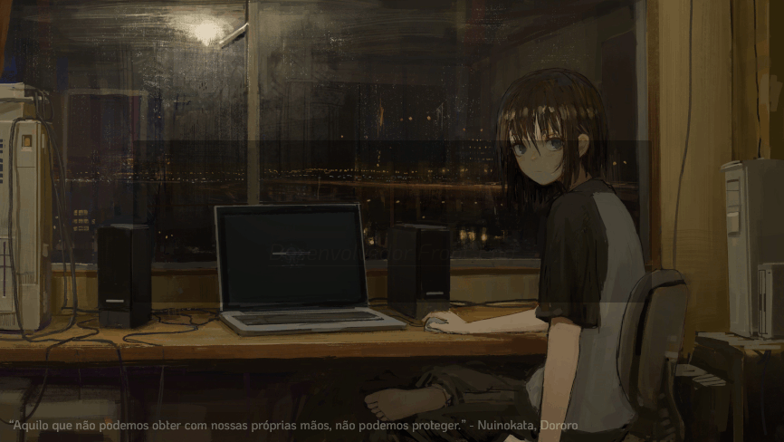

                       

<h2 align="center">📇 &ensp; <i>Ｓｏｂｒｅ</i></h2>

<table align="center">
  <tr>
    <td>
      <b>
        <a href="README.md">🇧🇷 Português</a>
      </b>
    </td>
    <td>
      <a href="readme-en.md">🇺🇸 English</a>
    </td>
  </tr>
</table>

<ul align="left">
    <li>🤩️ Amo Tecnologia, Animes, Phonk, Psicologia, Xadrez e Parkour.</li>
    <li>💻 <b>Trabalho</b> na <a href="https://github.com/delta-code-ltda" target="_blank">Delta Code</a> e já estudei no <a href="https://rodolfomori.com.br/devclub/" target="_blank">DevClub</a>, <a href="https://www.rocketseat.com.br/" target="_blank">Rocketseat</a>, <a href="https://www.alura.com.br/" target="_blank">Alura<a/>, <a href="https://estudonauta.com" target="_blank">Estudonauta</a> / <a href="https://www.cursoemvideo.com/" target="_blank">Curso em Video</a>, <a href="https://www.dio.me" target="_blank">DIO<a/> e <a href="https://www.devaria.com.br/" target="_blank">Devaria</a>.</li>
    <li>🔭 Com mais de 1 ano de <b>experiência</b>, tenho autonomia em diversas das tecnologias Front-end mais relevantes do mercado.</li>
    <li>🔮 Estou me especializando em Front-end, mas tenho boas noções de Back-end e Mobile, pois meu objetivo a longo prazo é me tornar Full-Stack.</li>
    <li>🚀 Evoluindo exponencialmente em <strong>React.js</strong> e em seu ecossistema.</li>
    <li>⚡ Fun fact: Eu estruturo minha rotina em Javascript.</li>
</ul>
 

<h2 align="center">🛠️ &ensp; <i>Ｔｅｃｎｏｌｏｇｉａｓ</i></h2>

<table align="right" height="266px">
  <tr>
    <td align="center">
      <a href="https://pt-br.reactjs.org/">
         
        
          <b>
            <pre>React.js</pre>
          </b>
        
      </a>
    </td>
    <td align="center">
      <a href="https://nextjs.org/">
         
        
          <b>
            <pre>Next.js</pre>
          </b>
        
      </a>
    </td>
    <td align="center">
      <a href="https://www.typescriptlang.org/">
         
        
          <b>
            <pre>Typescript</pre>
          </b>
        
      </a>
    </td>
    <td align="center">
      <a href="https://tailwindcss.com/">
       
      
        <b>
          <pre>Tailwind CSS</pre>
        </b>
      
      </a>
    </td>
    <td align="center">
      <a href="https://github.com/">
         
        
          <b>
            <pre>Gitflow</pre>
          </b>
        
      </a>
    </td>
  </tr>
    <tr>
    <td align="center">
      <a href="https://firebase.google.com/">
         
        
          <b>
            <pre>Firebase</pre>
          </b>
        
      </a>
    </td>
    <td align="center">
      <a href="https://next-auth.js.org/">
         
        
          <b>
            <pre>NextAuth</pre>
          </b>
        
      </a>
    </td>
    <td align="center">
      <a href="https://react-hook-form.com/">
         
        
          <b>
            <pre>React Hook Form</pre>
          </b>
        
      </a>
    </td>
    <td align="center">
      <a href="https://graphql.org/">
         
        
          <b>
            <pre>GraphQL</pre>
          </b>
        
      </a>
    </td>
    <td align="center">
      <a href="https://www.radix-ui.com/">
         
        
          <b>
            <pre>Radix UI</pre>
          </b>
        
      </a>
    </td>
  </tr>
  <tr>
    <td align="center">
      <a href="https://getbootstrap.com/">
       
      
        <b>
          <pre>Bootstrap</pre>
        </b>
      
      </a>
    </td>
    <td align="center">
      <a href="https://headlessui.com/">
         
        
          <b>
            <pre>HeadlessUI</pre>
          </b>
        
      </a>
    </td>
    <td align="center">
      <a href="https://styled-components.com/">
         
        
          <b>
            <pre>Styled Components</pre>
          </b>
        
      </a>
    </td>
    <td align="center">
      <a href="https://sass-lang.com/">
         
        
          <b>
            <pre>Sass</pre>
          </b>
       </a>
      
    </td>
    <td align="center">
      <a href="https://zod.dev/">
       
      
        <b>
          <pre>Zod & Yup</pre>
        </b>
      
      </a>
    </td>
  </tr>
  <tr>
    <td align="center">
      <a href="https://www.sanity.io/">
         
        
          <b>
            <pre>Sanity.io</pre>
          </b>
        
      </a>
    </td>
    <td align="center">
      <a href="https://stripe.com/en-br/">
         
        
          <b>
            <pre>Stripe</pre>
          </b>
        
      </a>
    </td>
    <td align="center">
      <a href="https://redux.js.org/">
         
        
          <b>
            <pre>Redux Toolkit</pre>
          </b>
        
      </a>
    </td>
    <td align="center">
      <a href="https://expressjs.com/">
         
        
          <b>
            <pre>Express.js</pre>
          </b>
        
      </a>
    </td>
    <td align="center">
      <a href="https://reactnative.dev/">
         
        
          <b>
            <pre>React Native</pre>
          </b>
        
     </a>
    </td>
  </tr>
  <tr>
    <td align="center">
      <a href="https://nativebase.io/">
         
        
          <b>
            <pre>NativeBase</pre>
          </b>
        
     </a>
    </td>
    <td align="center">
      <a href="https://axios-http.com/docs/intro">
       
      
        <b>
          <pre>Axios & FetchAPI</pre>
        </b>
      
      </a>
    </td>
    <td align="center">
      <a href="https://nodejs.org/en">
         
        
          <b>
            <pre>Node.js</pre>
          </b>
        
      </a>
    </td>
    <td align="center">
      <a href="https://developer.mozilla.org/en-US/docs/Web/JavaScript/">
         
        
          <b>
            <pre>Javascript</pre>
          </b>
        
      </a>
    </td>
    <td align="center">
      <a href="https://developer.mozilla.org/en-US/docs/Web/CSS/">
         
        
          <b>
            <pre>CSS3</pre>
          </b>
        
      </a>
    </td>
  </tr>
  <tr>
    <td align="center">
      <a href="https://developer.mozilla.org/en-US/docs/Web/HTML/">
         
        
          <b>
            <pre>HTML5</pre>
          </b>
        
      </a>
    </td>
    <td align="center">
      <a href="https://ohmyz.sh/">
         
        
          <b>
            <pre>Terminal</pre>
          </b>
        
      </a>
    </td>
    <td align="center">
      <a href="https://code.visualstudio.com/">
         
        
          <b>
            <pre>VSCode</pre>
          </b>
        
      </a>
    </td>
    <td align="center">
      <a href="https://pop.system76.com/">
         
        
          <b>
            <pre>Linux & Windows</pre>
          </b>
        
      </a>
    </td>
  </tr>
</table>
            

<h2 align="center">
  

    
📈 &ensp; <i>Ａｔｉｖｉｄａｄｅ</i>

     
    
      
    
    

      
      
    

     
    
  

 

   
<!--

- 🔭 I’m currently working on ...
- 🌱 I’m currently learning ...
- 👯 I’m looking to collaborate on ...
- 🤔 I’m looking for help with ...
- 💬 Ask me about ...
- 📫 How to reach me: ...
- 😄 Pronouns: ...
- ⚡ Fun fact: ...

-->
