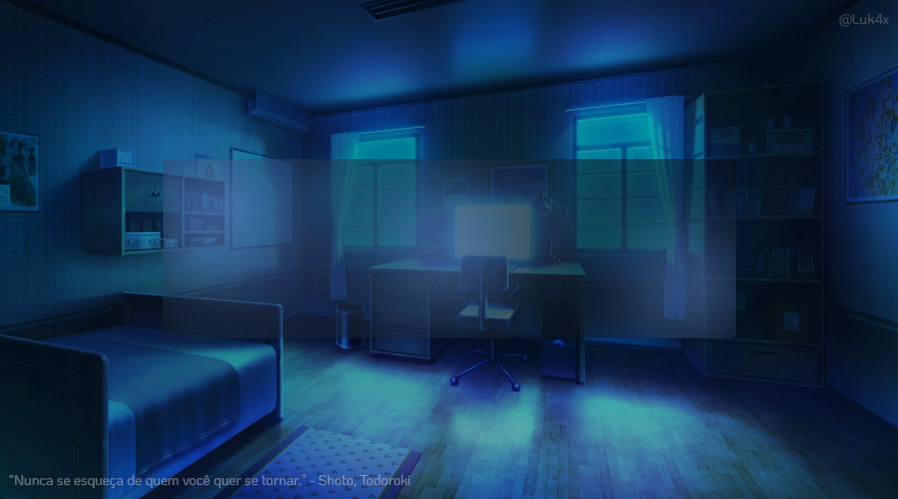

<table align="right">
  <tr>
    <td height="43px">
      <b>
        <a href="README.md">Português 🇧🇷</a>
      </b>
    </td>
  </tr>
  <tr>
    <td height="43px">
      <a href="readme-en.md">English 🇺🇸</a>
    </td>
  </tr>
</table>

  

  

<ul>
  <li>🤩️ Apaixonado por Programação, Animes e Música.</li>
  <li>💻 <b>Trabalho</b> na <a href="https://www.delta-code.online/" target="_blank">Delta Code</a> e já estudei na <a href="https://www.origamid.com/" target="_blank">Origamid</a>, <a href="https://rodolfomori.com.br/devclub/" target="_blank">DevClub</a>, <a href="https://www.rocketseat.com.br/" target="_blank">Rocketseat</a>, <a href="https://www.alura.com.br/" target="_blank">Alura<a/>, <a href="https://estudonauta.com" target="_blank">Estudonauta</a>, <a href="https://www.dio.me" target="_blank">DIO<a/> e <a href="https://www.devaria.com.br/" target="_blank">Devaria</a>.</li>
  <li>🔭 Com mais de 2 anos de <b>experiência</b>, tenho autonomia em diversas das tecnologias Front-end mais relevantes do mercado.</li>
  <li>🔮 Estou me especializando em Front-end, mas tenho noções de Back-end e Mobile.</li>
  <li>🚀 Evoluindo continuamente em <strong>React.js</strong> e em seu ecossistema.</li>
  <li>🇺🇸 Tenho inglês intermediário.</li>
  <li>🎮 Curto jogar <a href="https://tracker.gg/valorant/profile/riot/Luk4x%23null/overview?playlist=unrated&season=all" target="_blank">Valorant</a>, <a href="https://osu.ppy.sh/users/13780075" target="_blank">Osu</a>, <a href="https://namemc.com/profile/Kiy0u.1" target="_blank">HG/PotPvP</a>, e <a href="https://www.chess.com/member/kiy0u" target="_blank">Xadrez</a>.</li>
  <li>
    

      
👽 Curiosidades:

      <ul>
        <li>🤖 Estruturo minha rotina em Javascript.</li>  
        <li>⛩️ Já assisti mais de 450 animes.</li>
      </ul>
    

  </li>
</ul>
 

  

<table align="right" height="255px">
  <tr>
    <td align="center">
      <a href="https://pt-br.reactjs.org/">
         
        
          <b>
            <pre>React.js</pre>
          </b>
        
      </a>
    </td>
    <td align="center">
      <a href="https://nextjs.org/">
         
        
          <b>
            <pre>Next.js</pre>
          </b>
        
      </a>
    </td>
    <td align="center">
      <a href="https://www.typescriptlang.org/">
         
        
          <b>
            <pre>Typescript</pre>
          </b>
        
      </a>
    </td>
    <td align="center">
      <a href="https://tailwindcss.com/">
       
      
        <b>
          <pre>Tailwind CSS</pre>
        </b>
      
      </a>
    </td>
    <td align="center">
      <a href="https://github.com/">
         
        
          <b>
            <pre>Gitflow</pre>
          </b>
        
      </a>
    </td>
  </tr>
    <tr>
    <td align="center">
      <a href="https://firebase.google.com/">
         
        
          <b>
            <pre>Firebase</pre>
          </b>
        
      </a>
    </td>
    <td align="center">
      <a href="https://next-auth.js.org/">
         
        
          <b>
            <pre>NextAuth</pre>
          </b>
        
      </a>
    </td>
    <td align="center">
      <a href="https://react-hook-form.com/">
         
        
          <b>
            <pre>React Hook Form</pre>
          </b>
        
      </a>
    </td>
    <td align="center">
      <a href="https://graphql.org/">
         
        
          <b>
            <pre>GraphQL</pre>
          </b>
        
      </a>
    </td>
    <td align="center">
      <a href="https://www.radix-ui.com/">
         
        
          <b>
            <pre>Radix UI</pre>
          </b>
        
      </a>
    </td>
  </tr>
  <tr>
    <td align="center">
      <a href="https://getbootstrap.com/">
       
      
        <b>
          <pre>Bootstrap</pre>
        </b>
      
      </a>
    </td>
    <td align="center">
      <a href="https://headlessui.com/">
         
        
          <b>
            <pre>HeadlessUI</pre>
          </b>
        
      </a>
    </td>
    <td align="center">
      <a href="https://styled-components.com/">
         
        
          <b>
            <pre>Styled Components</pre>
          </b>
        
      </a>
    </td>
    <td align="center">
      <a href="https://sass-lang.com/">
         
        
          <b>
            <pre>Sass</pre>
          </b>
       </a>
      
    </td>
    <td align="center">
      <a href="https://zod.dev/">
       
      
        <b>
          <pre>Zod & Yup</pre>
        </b>
      
      </a>
    </td>
  </tr>
  <tr>
    <td align="center">
      <a href="https://www.sanity.io/">
         
        
          <b>
            <pre>Sanity.io</pre>
          </b>
        
      </a>
    </td>
    <td align="center">
      <a href="https://stripe.com/en-br/">
         
        
          <b>
            <pre>Stripe</pre>
          </b>
        
      </a>
    </td>
    <td align="center">
      <a href="https://redux.js.org/">
         
        
          <b>
            <pre>Redux Toolkit</pre>
          </b>
        
      </a>
    </td>
    <td align="center">
      <a href="https://expressjs.com/">
         
        
          <b>
            <pre>Express.js</pre>
          </b>
        
      </a>
    </td>
    <td align="center">
      <a href="https://reactnative.dev/">
         
        
          <b>
            <pre>React Native</pre>
          </b>
        
     </a>
    </td>
  </tr>
  <tr>
    <td align="center">
      <a href="https://nativebase.io/">
         
        
          <b>
            <pre>NativeBase</pre>
          </b>
        
     </a>
    </td>
    <td align="center">
      <a href="https://axios-http.com/docs/intro">
       
      
        <b>
          <pre>Axios & FetchAPI</pre>
        </b>
      
      </a>
    </td>
    <td align="center">
      <a href="https://nodejs.org/en">
         
        
          <b>
            <pre>Node.js</pre>
          </b>
        
      </a>
    </td>
    <td align="center">
      <a href="https://developer.mozilla.org/en-US/docs/Web/JavaScript/">
         
        
          <b>
            <pre>Javascript</pre>
          </b>
        
      </a>
    </td>
    <td align="center">
      <a href="https://developer.mozilla.org/en-US/docs/Web/CSS/">
         
        
          <b>
            <pre>CSS3</pre>
          </b>
        
      </a>
    </td>
  </tr>
  <tr>
    <td align="center">
      <a href="https://developer.mozilla.org/en-US/docs/Web/HTML/">
         
        
          <b>
            <pre>HTML5</pre>
          </b>
        
      </a>
    </td>
    <td align="center">
      <a href="https://ohmyz.sh/">
         
        
          <b>
            <pre>Terminal</pre>
          </b>
        
      </a>
    </td>
    <td align="center">
      <a href="https://code.visualstudio.com/">
         
        
          <b>
            <pre>VSCode</pre>
          </b>
        
      </a>
    </td>
    <td align="center">
      <a href="https://pop.system76.com/">
         
        
          <b>
            <pre>Linux & Windows</pre>
          </b>
        
      </a>
    </td>
  </tr>
</table>
            

  

  <!--
  <a href="https://www.canva.com/design/DAFSw49nC14/CDdcLsJ4a-uwMAWG_cq4zQ/view?utm_content=DAFSw49nC14&utm_campaign=designshare&utm_medium=link&utm_source=publishsharelink" target="_blank">
    
    &nbsp;
  </a>
  -->
  <a href="mailto:luk4xm4ci3l@gmail.com" target="_blank">
    
    &nbsp;
  </a>
  <a href="https://www.linkedin.com/in/lucasmacielf/" target="_blank">
    
    &nbsp;
  </a>
  <a href="https://cursos.alura.com.br/vitrinedev/lucasmacielf" target="_blank">
    
    &nbsp;
  </a>
  <a href="https://t.me/lu_k4x" target="_blank">
    
    &nbsp;
  </a>
  <a href="https://wa.me/5522996112570?text=Yo,%20Luk4x!%20Vim%20pelo%20seu%20Github!" target="_blank">
    
    &nbsp;
  </a>
  <a href="https://www.instagram.com/lu_k4x/" target="_blank">
    
    &nbsp;
  </a>
  <a href="https://stackoverflow.com/users/18881418/lucas-maciel" target="_blank">
    
    &nbsp;
  </a>
  

  

<table height="495px" align="right">
  <tr>
    <td>
    
    </td>
  </tr>
  <tr>
    <td>
    
    </td>
  </tr>
  <tr>
    <td>
    
    </td>
  </tr>
  <tr>
    <td>
    
    </td>
  </tr>
  <tr>
    <td>
    
    </td>
  </tr>
  <tr>
    <td>
     
    </td>
  </tr>
  <tr>
    <td>
    
    </td>
  </tr>
  <tr>
    <td>
    
    </td>
  </tr>
  <tr>
    <td>
    
    </td>
  </tr>
  <tr>
    <td>
    
    </td>
  </tr>
  <tr>
    <td>
    
    </td>
  </tr>
  <tr>
    <td>
    
    </td>
  </tr>
  <tr>
    <td>
    
    </td>
  </tr>
  <tr>
    <td>
    
    </td>
  </tr>
  <tr>
    <td>
    
    </td>
  </tr>
  <tr>
    <td>
    
    </td>
  </tr>
  <tr>
    <td>
    
    </td>
  </tr>
  <tr>
    <td>
    
    </td>
  </tr>
  <tr>
    <td>
    
    </td>
  </tr>
  <tr>
    <td>
    
    </td>
  </tr>
  <tr>
    <td>
    
    </td>
  </tr>
  <tr>
    <td>
    
    </td>
  </tr>
</table>
                        

  
  

 

  

<!--

- Para implementar a funcionalidade de trocar de idioma, basta criar outro readme na raíz do repositório e linkar ele aqui;
- Para fazer o Banner animado, pode pegar como base esse meu repositório aqui: https://github.com/Luk4x/github-profile-background-photo;
- O Contador de visitas que uso é esse: https://github.com/feri-irawan/visitor-badge;
- Você pode adicionar seu Spotify no seu readme seguindo esses passos: https://github.com/tthn0/Spotify-Readme;
- Para adicionar o gerador de frases, siga esses passos: https://github.com/PiyushSuthar/github-readme-quotes;
- Para criar um scoll em markdown, é simples. Se consiste numa tabela com uma definição de height que seja menor que sua proporção;
- A maioria dos ícones de tecnologias que utilizei, foi dessa projeto: https://github.com/tandpfun/skill-icons;
- Em relação aos cards com informações sobre o meu perfil, você pode encontrá-los em:
  - https://github.com/anuraghazra/github-readme-stats;
  - https://github.com/Ashutosh00710/github-readme-activity-graph;
  - https://github.com/DenverCoder1/github-readme-streak-stats;
- Para criar a animação de ondas que utilizei no final do readme: https://svgwave.in;
-->
